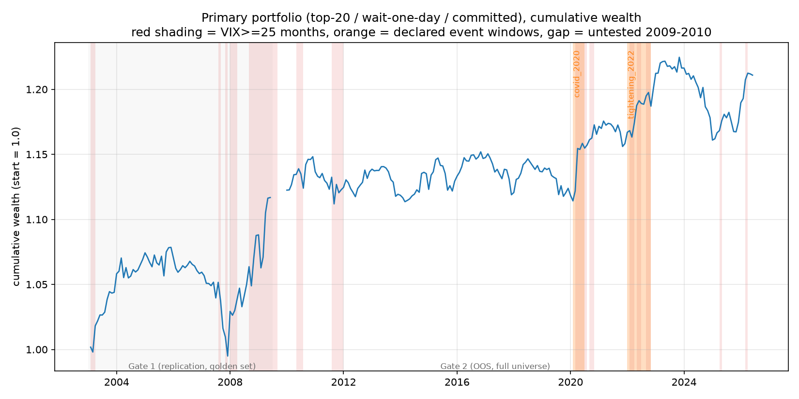
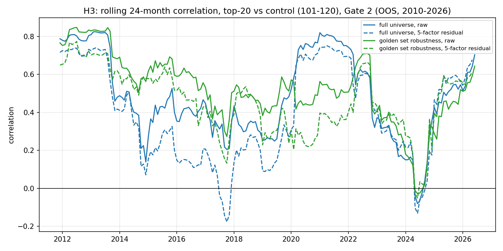
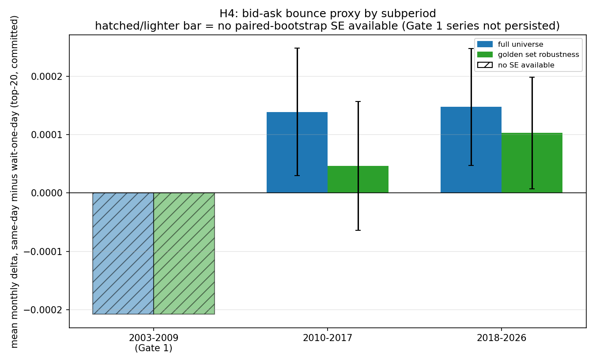

# Pairs trading, twenty years later

A frozen replication of Gatev, Goetzmann & Rouwenhorst's 2006 paper, "Pairs
Trading: Performance of a Relative-Value Arbitrage Rule" (GGR), extended
out-of-sample to 2010–2026, plus a data-quality audit trail that turned out
to matter as much as the results themselves.

**Research question:** did GGR-style pairs trading die, go dormant, or stay
alive only during market turbulence? This isn't a strategy pitch. Every
parameter (12-month formation, 6-month trading, 2σ trigger) is inherited
from the 2006 paper and was frozen before any result was seen (`PROTOCOL.md`,
ratified 2026-07-05), and every place a result deviated from what the
protocol predicted is logged, dated, and explained in `DEVIATIONS.md`
instead of being quietly patched.

---

## Results at a glance

- **The effect has shrunk, not disappeared.** Top-20/wait-one-day/committed
  capital: **14.84 bp/month** in the 2003–2009 replication window (t=1.50,
  not significant) → **4.25–4.94 bp/month** out-of-sample 2010–2026
  (t≈1.06–1.12, not significant). Neither period rejects H0: μ≤0 at
  conventional levels, and the point estimate is roughly a third of what it
  was: consistent with the protocol's own "decline completed" reading of H1.
- **The turbulence exception held up (H2).** High-vol months (VIX≥25)
  regression: `return = a + b·HighVol`, **b = 0.31%/month, t = 2.14**
  (n=198). Both declared event windows (COVID, Feb–Jun 2020, and the 2022
  tightening) have bootstrap confidence intervals for cumulative return
  that exclude zero.
- **The bid-ask bounce mostly evaporated, in the expected direction, but
  not significantly (H4).** Same-day minus wait-one-day delta on top-20
  committed capital: **+1.4 to +1.5 bp/month** OOS (both sub-periods,
  full-universe arm), against a GGR-era baseline that implied tens of bp.
  The result sits in the predicted direction, small in size, though the
  bootstrap CI includes zero in both OOS sub-periods.
- **H3 did not confirm its own prediction.** The protocol predicted the
  top-20/control common-factor correlation would decay toward ~0.2. It
  didn't: it sits at 0.48–0.52 raw (0.39–0.45 on 5-factor residuals) across
  2010–2026, closer to GGR's own *pre-1989* full-sample number than to
  their post-1988 decline. This is reported as observed rather than
  adjusted to fit.

Full numbers: `results/replication/gate1_results.json` (Gate 1, frozen at
commit `7df2a10`) and `results/frozen/gate2_results.json` (Gate 2, frozen at
commit `334f185`, after a documented data-quality fix; see
[Data quality and limitations](#data-quality-and-limitations)).

---

## Methodology

Full detail in `PROTOCOL.md`; summary here.

- **Formation (252 trading days) → trading (126 days) → next month, 6 staggered overlapping portfolios**, averaged Jegadeesh-Titman style, exactly as in GGR.
- **Matching:** minimum sum-of-squared-deviations (SSD) between normalized
  total-return price paths built in the formation period. Portfolios:
  **top-5**, **top-20 (primary)**, and pairs ranked **101–120** as a
  deliberately-worse-matched control group.
- **Trigger:** open when `|spread| > 2σ`, σ estimated only on the formation
  period and frozen before trading starts. The trading period can never
  influence its own trigger.
- **Two execution variants, always both:** same-day (enter the instant the
  signal fires) and wait-one-day (confirm the next day; if the spread has
  already reverted, the trade is skipped; see `src/trading.py`).
- **Two capital measures, always both:** return on committed capital
  (÷ nominal portfolio size) and return on employed capital (÷ pairs
  actually open that day); committed is primary.
- **Two universes, always both, for different reasons:**
  - **Golden set:** tickers with a *complete* Yahoo price history in
    *every single* formation window across the window in question. Used to
    validate the mechanical fidelity of the engine (Gate 1) without
    Yahoo's survivorship gap contaminating that check.
  - **Full point-in-time universe:** every actual S&P 500 constituent at
    each formation date, survivorship bias and all. This is the **primary**
    basis for Gate 2 (`DEVIATIONS.md`, Gate 0 entry). The golden set's role
    has always been a fidelity check, and it is re-run here only as an
    explicit robustness arm alongside the full universe.
- **Falsification tests (not optional):** decile-matched random-pair
  bootstrap (200 reps: replace every real pair with two tickers from the
  same prior-month return decile, expected result ≈0 or negative),
  long/short 5-factor alpha decomposition, and a standard 5-factor
  (Mkt-RF, SMB, HML, Momentum, ST-Reversal) excess-return regression with
  Newey-West(6) standard errors throughout.
- **Gate 1** (2003–2009) validates replication fidelity against Do & Faff's
  CRSP-era numbers. **Gate 2** (2010–2026) is the frozen, one-shot
  out-of-sample run: executed once, with a second, explicitly-logged
  re-execution after a data-quality fix (below), and never silently re-run.

---

## Results by hypothesis

### H1: has the decline completed?

Primary metric: top-20, wait-one-day, committed capital, mean monthly
return, Newey-West(6) t-stat.

| period | universe | mean/month | t (NW) | ann. Sharpe | n months |
|---|---|---|---|---|---|
| 2003–2009 (Gate 1) | golden set | 0.1484% | 1.50 | 0.52 | 77 |
| 2010–2026 (Gate 2) | full universe | 0.0425% | 1.06 | 0.26 | 198 |
| 2010–2026 (Gate 2) | golden set (robustness) | 0.0494% | 1.12 | 0.26 | 198 |

Neither period's mean is statistically distinguishable from zero at
conventional significance. The point estimate drops by roughly two-thirds
from the replication window to OOS. Read plainly: we can't even confidently
say the strategy made money 2003–2009 on this measure, and whatever edge
existed is smaller still since 2010. That is consistent with "the decline
completed," the outcome the protocol itself flagged as expected and fully
publishable (`PROTOCOL.md` §4/H1).



*Figure 1: top-20/wait-one-day/committed capital, Gate 1 (golden set) and
Gate 2 (full universe) concatenated. Red shading = VIX≥25 months, orange =
the two declared event windows, gray gap = the untested ~6 months between
the two frozen windows (mid-2009 to end-2009).*

### H2: did the turbulence exception hold?

| | full universe | golden set (robustness) |
|---|---|---|
| a (intercept) | 0.0059%/month | 0.0088%/month |
| b (HighVol, VIX≥25) | **0.3147%/month** | 0.3492%/month |
| t(b), Newey-West | **2.14** | 1.83 |
| high-vol months | 23/198 | 23/198 |

| event window | months | cumulative return | bootstrap CI (compounded, approx.) |
|---|---|---|---|
| COVID (Feb–Jun 2020) | 5 | +3.58% | [+0.28%, +7.04%] |
| 2022 tightening (Jan–Oct 2022) | 10 | +3.40% | [+1.59%, +5.39%] |

Both event windows have a cumulative-return confidence interval that
excludes zero, and the full-universe regression's high-vol coefficient is
significant at the 5% level. This is the cleanest positive finding in the
project: pairs trading looks dormant on average but wakes up specifically
when volatility spikes, matching the pattern GGR describe in the weak
markets of the 1970s and that Do & Faff confirm in 2000–02 and 2007–09.

### H3: is the latent common factor still there?

Predicted (PROTOCOL.md, extrapolating GGR's post-1988 decay): rolling
24-month correlation between top-20 and control (disjoint portfolios)
settling near ~0.2.

| | full universe | golden set (robustness) |
|---|---|---|
| mean raw correlation | 0.482 | 0.522 |
| mean 5-factor residual correlation | 0.389 | 0.454 |



*Figure 2: rolling 24-month correlation between top-20 and control
(101–120), raw and 5-factor-residual, Gate 2 only (2010–2026; a 24-month
window needs more history than Gate 1's 6-year window comfortably gives).*

This does **not** match the prediction. GGR themselves report 0.48 full-sample
(0.51 pre-1989 → 0.18 post-1988; on residuals 0.42 → 0.20). Our 2010–2026
numbers land close to GGR's *pre-1989* level; the post-1988 decline is
nowhere to be seen. The common factor behind pairs-trading returns looks
just as present as it did decades ago, even though the *returns* it's
associated with have shrunk (H1). See Figure 2. The protocol's own
prediction was simply wrong here, and it's worth saying so plainly instead
of glossing over it.

### H4: did the bid-ask bounce collapse?

Metric: mean(same-day) − mean(wait-one-day), top-20, committed capital, by
sub-period. GGR's own fully-invested baseline implied a ~54 bp/month gap
(pre-decimalization spreads); the protocol predicted under 10 bp/month for
2010–2026 given today's large-cap spreads.

| sub-period | universe | mean delta/month | bootstrap SE | 95% CI |
|---|---|---|---|---|
| 2003–2009 (Gate 1) | golden set | **−2.08 bp** | n/a¹ | n/a |
| 2010–2017 | full universe | +1.39 bp | 1.09 bp | [−0.64, +3.60] bp |
| 2010–2017 | golden set (robustness) | +0.46 bp | 1.10 bp | [−1.56, +2.71] bp |
| 2018–2026 | full universe | +1.48 bp | 1.00 bp | [−0.55, +3.37] bp |
| 2018–2026 | golden set (robustness) | +1.03 bp | 0.96 bp | [−0.85, +2.92] bp |

¹ Gate 1's paired monthly series wasn't persisted, only the difference of
means, so no bootstrap SE is available for that row (see Figure 3, hatched
bar).



*Figure 3: hatched/lighter bar marks the 2003–2009 value computed only as
a difference of means, with no bootstrap standard error available (unlike
the two OOS sub-periods, which do have one).*

Two things are true here, and neither one is glossed over for the sake of
a clean story. First, the 2003–2009 delta is **negative**: wait-one-day
beat same-day, the opposite of GGR's expectation, an anomaly investigated
and explained in `DEVIATIONS.md` (persistent signals keep drifting before
reverting; entering a day later avoids that residual move). Second, both
OOS sub-periods flip to the **expected sign** and land well under the
predicted 10 bp/month ceiling, consistent with a mostly-collapsed
microstructure cost. The confidence intervals still include zero, though,
so this reads as a small, correctly-signed point estimate that hasn't
cleared the bar for statistical significance.

---

## Data quality and limitations

This section isn't a footnote. Three of the four items below only came to
light because the frozen protocol forces anomalies into the open instead
of letting them get tuned away quietly.

### Survivorship bias (quantified, structural, not fixable with free data)

Yahoo Finance does not truncate a delisted ticker's history at its
delisting date. It deletes the ticker's entire history instead, including
for names later relisted or reused. Point-in-time universe attrition (share
of that year's S&P 500 membership with a complete Yahoo history), full
table in `results/replication/attrition.csv`:

| year | share complete | year | share complete |
|---|---|---|---|
| 2003 | 51.9% | 2015 | 74.0% |
| 2005 | 54.9% | 2018 | 80.9% |
| 2009 | 63.7% | 2021 | 88.1% |
| 2012 | 69.0% | 2025 | 96.8% |

**Direction of the bias:** pairs that never converge are disproportionately
the ones that get force-closed by delisting; excluding them **inflates**
measured returns. Every OOS number in this README is therefore an **upper
bound**: if even the upper bound is ≈0 (H1), the decline conclusion holds
*a fortiori*. The golden-set/full-universe split exists specifically to
give both an internally-consistent fidelity check and a primary result that
reports this bias honestly.

### Two corrupted-data bugs found and fixed during Gate 2

The first Gate 2 run (full universe) produced a decile-matched bootstrap
with replicate means around **10¹⁸ %**, a clear sign of a numerical bug
rather than a real strategy result. Root cause: **25 tickers** with
severely corrupted Yahoo data, almost certainly recycled ticker symbols
reassigned to illiquid OTC/penny-stock entities after the original company
delisted (e.g. `CBE` oscillating between $0.005 and $170 with zero-volume
stale quotes on the high days).

Impact, quantified: 57 of 192 OOS runs had at least one of the 25 corrupted
tickers survive the pre-existing no-trade-day completeness filter (none of
them have any missing data, so that filter alone didn't catch them). Of
those, **5 pair-selections across 2 runs** were real contamination, not
just possible bootstrap substitutes: always the same ticker, `BMC`, in
runs 2014-01 and 2014-04.

Two new causal filters were added (`src/formation.py`, parameters
explicitly marked in `config.py` as post-hoc additions, distinct from the
protocol's frozen parameters): an extreme-daily-return filter
(`MAX_ABS_DAILY_RETURN`, 300%) and a frozen/stale-price filter
(`MAX_CONSECUTIVE_FROZEN_DAYS`, 5 consecutive identical closes). The `BMC`
contamination turned out to be the second kind: a price frozen
bit-identical for months, which produces zero daily return and so never
trips the first filter, but fakes a low SSD against anything else that
barely moves. Both filters are strictly causal, only ever inspecting the
current run's own formation window and never future data; this is verified
with dedicated tests (`tests/test_formation.py`). The full-universe arm of
Gate 2 was re-run once after the fix, **explicitly logged as a second
execution**, with the pre-fix numbers preserved alongside the corrected
ones (`gate2_results.json`, key `full_universe_before_fix`) instead of
being silently overwritten. Full writeup: `DEVIATIONS.md`, 2026-07-05
entries.

### Long/short alpha does not add up to net alpha: by construction, not by error

`alpha_long − alpha_short` from the long/short decomposition will not equal
the primary portfolio's own net factor-regression alpha, and that's
expected. Both legs are compounded monthly as independent stand-alone
sub-portfolios (the standard approach for this decomposition), while the
net portfolio compounds the already-netted daily series; compounding is
non-linear, so the two aggregation paths diverge by construction. This was
verified empirically down to the single pair-day level, with an exact
match there and at the pre-compounding daily-portfolio level; the
divergence only shows up after monthly compounding, typically a few
bp/month. Documented in `src/inference.py` and in both
`gate1_report.md`/`gate2_report.md`.

### Gate 1's control-beats-top-20 divergence: cause identified, not fully decomposed

In the replication window, wait-one-day outperforms same-day on
top-5/top-20 (reversed vs. GGR), and the control portfolio (101–120)
outperforms top-20 on both portfolio return and payoff per trade
(2.45×–3.02×, against a formation-sigma ratio of only ~1.4×). Pair-by-pair
diagnostics ruled out an implementation bug (SSD monotonic, mechanics
identical day-by-day, no return duplication). The likely driver is the
golden set's own construction: requiring complete survival in *every* run
2003–2009 tends to compress the top-20 toward highly correlated,
low-spread mega-caps, though this explains the *direction* and not the
full *magnitude* of the divergence. It stays as an open, dated item in
`DEVIATIONS.md`; nothing here has been forced to a tidy conclusion.

---

## Extensions in progress

**H5: does clustering-based pair selection improve discovery quality?**
Planned per `PROTOCOL.md` §4/H5, **not yet implemented** (no
`src/selection_cluster.py` exists in this repository yet; this section
describes a design, not shipped code). The plan: PCA (10 components) on
standardized formation-period returns, clustering primarily via OPTICS
(`min_samples=3`, ξ=0.05, with a k-means/silhouette fallback), candidate
pairs restricted to intra-cluster, compared against a brute-force
Engle-Granger cointegration screen across all ~125,000 candidate pairs
with Benjamini-Hochberg (and Benjamini-Yekutieli, for arbitrary dependence)
multiple-testing correction. The intended message here is about discovery
quality, not raw performance: "clustering finds fewer false discoveries at
the same performance" is the goal, not "clustering makes more money."
Discovery quality (OOS spread stationarity, convergence rate) is the
primary comparison metric.

---

## How to reproduce

```bash
python3 -m venv .venv && source .venv/bin/activate
pip install -r requirements.txt
```

Gate 0 (data): point-in-time universe, price cache, and golden sets:
```bash
python -m data.prices              # downloads + caches prices (hours; resumable)
python -m data.prices attrition    # writes results/replication/attrition.csv
python -m data.golden_set          # results/replication/golden_set.csv (315 tickers)
python -m data.golden_set oos      # results/frozen/golden_set_oos.csv (568 tickers)
python -m data.factors             # Ken French factors + risk-free, cached
```

Gate 1 (replication) and Gate 2 (frozen OOS, one-shot per protocol):
```bash
python notebooks/02_gate1_replication.py
python notebooks/03_gate2_frozen_run.py   # do not re-run without a documented reason
```

Figures for this README:
```bash
python notebooks/04_readme_figures.py      # results/figures/fig1-3
```

Tests:
```bash
pytest tests/
```

---

## References

- Gatev, E., Goetzmann, W. N., & Rouwenhorst, K. G. (2006). Pairs Trading:
  Performance of a Relative-Value Arbitrage Rule. *Review of Financial
  Studies*, 19(3), 797–827.
- Do, B., & Faff, R. (2010). Does Simple Pairs Trading Still Work?
  *Financial Analysts Journal*, 66(4), 83–95.
