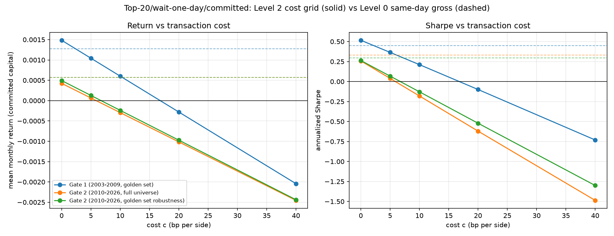

# Pairs trading, twenty years later

Angelo Marano, BSc Statistics, incoming MSc Statistics @ ETH Zurich

In 2006, Gatev, Goetzmann and Rouwenhorst showed that a simple pairs-trading
rule (match two co-moving stocks, bet that a price gap between them closes)
had beaten the market for four decades. By the mid-2000s the edge was
already fading in their own data. Nobody had tested whether anything was
left of it seventeen years later.

This project runs that test: a frozen, pre-registered replication of GGR's
original rule, extended out-of-sample through 2026. Every parameter
(12-month formation, 6-month trading, 2σ trigger) is inherited from the
2006 paper and was fixed before any result was seen (`PROTOCOL.md`,
ratified 2026-07-05); every place a result broke the protocol's own
prediction is logged, dated, and explained in `DEVIATIONS.md` rather than
quietly patched. The short answer: the average edge is gone, but not
everywhere. It comes back, sharply, exactly when markets panic.

---

## Results at a glance

- **The edge shrank by two-thirds and stopped being statistically real.**
  Top-20/wait-one-day/committed capital: 14.84 bp/month in the 2003–2009
  replication window (t=1.50) fell to 4.25–4.94 bp/month out-of-sample
  2010–2026 (t≈1.06–1.12). Neither period clears conventional
  significance: even the 2003–2009 number can't be called "money made"
  with any confidence.
- **It comes back to life under stress.** Months with VIX≥25 add
  0.31%/month to returns (t=2.14, n=198). Both COVID (Feb–Jun 2020) and
  the 2022 rate-hike cycle have bootstrap confidence intervals for
  cumulative return that exclude zero.
- **The bid-ask bounce that used to separate same-day from wait-one-day
  execution has all but disappeared**, in the direction the
  decimalization story predicts (+1.4 to +1.5 bp/month OOS, against a
  GGR-era gap worth tens of bp), though the estimate itself doesn't
  clear statistical significance.
- **One prediction failed outright.** The common factor linking top-20
  and control-portfolio returns was expected to decay toward ~0.2 by
  2010–2026. It sits at 0.48–0.52 instead, closer to GGR's own 1960s
  number than to their post-1988 decline.

Full numbers: `results/replication/gate1_results.json` (Gate 1, frozen at
commit `7df2a10`) and `results/frozen/gate2_results.json` (Gate 2, frozen
at commit `334f185`, after a documented data-quality fix; see
[Data quality and limitations](#data-quality-and-limitations)).

---

## Methodology

Full detail lives in `PROTOCOL.md`; here's the shape of it.

- **Formation (252 trading days) → trading (126 days) → roll forward a
  month, six staggered overlapping portfolios**, averaged Jegadeesh-Titman
  style, exactly GGR's design.
- **Matching:** minimum sum-of-squared-deviations (SSD) between normalized
  total-return price paths built during formation. Three portfolios:
  **top-5**, **top-20** (primary), and pairs ranked **101–120** as a
  deliberately worse-matched control group.
- **Trigger:** open when `|spread| > 2σ`, with σ estimated only on the
  formation period and frozen before trading starts. The trading period
  can never feed back into its own trigger.
- **Two execution rules, run side by side every time:** same-day (enter
  the instant the signal fires) and wait-one-day (confirm the next day;
  if the spread has already reverted, the trade is skipped; see
  `src/trading.py`).
- **Two capital measures, also run side by side:** return on committed
  capital (÷ nominal portfolio size) and return on employed capital
  (÷ pairs actually open that day). Committed is primary.
- **Two universes, for genuinely different reasons.** The **golden set**
  (tickers with a complete Yahoo price history in every formation window
  in the period) checks the engine's mechanical correctness (Gate 1)
  without Yahoo's survivorship gaps muddying that check. The **full
  point-in-time universe**, survivorship bias included, is the **primary**
  basis for Gate 2 (see `DEVIATIONS.md`, Gate 0 entry); the golden set is
  re-run alongside it only as an explicit robustness arm.
- **Falsification tests, none of them optional:** a decile-matched
  random-pair bootstrap (200 reps: swap every real pair for two tickers
  from the same prior-month return decile, expect ≈0 or negative), a
  long/short 5-factor alpha decomposition, and a 5-factor (Mkt-RF, SMB,
  HML, Momentum, ST-Reversal) excess-return regression with Newey-West(6)
  errors throughout.
- **Gate 1** (2003–2009) checks replication fidelity against Do & Faff's
  CRSP-era numbers. **Gate 2** (2010–2026) is the frozen, one-shot
  out-of-sample run: executed once, with a single, explicitly logged
  re-execution after a data-quality fix (below), never a silent re-run.

---

## Results by hypothesis

### H1: has the decline completed?

Primary metric: top-20, wait-one-day, committed capital, mean monthly
return, Newey-West(6) t-stat.

| period | universe | mean/month | t (NW) | ann. Sharpe | n months |
|---|---|---|---|---|---|
| 2003–2009 (Gate 1) | golden set | 0.1484% | 1.50 | 0.52 | 77 |
| 2010–2026 (Gate 2) | full universe | 0.0425% | 1.06 | 0.26 | 198 |
| 2010–2026 (Gate 2) | golden set (robustness) | 0.0494% | 1.12 | 0.26 | 198 |

Neither period's mean clears conventional significance. The point
estimate drops by roughly two-thirds from the replication window to the
OOS window. Put plainly: there's no confident evidence the strategy made
money even in 2003–2009 on this measure, and whatever edge existed is
smaller still after 2010. That's the outcome `PROTOCOL.md` itself flagged
as the expected, fully publishable result for H1.


*Figure 1: top-20/wait-one-day/committed capital, Gate 1 (golden set) and
Gate 2 (full universe) concatenated. Red shading = VIX≥25 months, orange =
the two declared event windows, gray gap = the untested ~6 months between
the two frozen windows (mid-2009 to end-2009).*

**Transaction costs point the same way, independently.** `PROTOCOL.md`
§5's cost grid (0–40 bp/side, four trades per round-trip, applied to the
actual per-pair trade logs, see `results/replication/cost_curve.md`)
pushes the primary portfolio's mean monthly return to break-even at:

| window | break-even c* |
|---|---|
| Gate 1 (2003–2009) | 16.8 bp/side |
| Gate 2, full universe (2010–2026) | 5.9 bp/side |
| Gate 2, golden set robustness (2010–2026) | 6.7 bp/side |

Liquid large-cap S&P 500 names typically trade at effective spreads of
1–5 bp/side in the post-decimalization era. An OOS break-even of
5.9–6.7 bp/side sits right at the edge of that range: the cost cushion is
thin, not comfortable. Gate 1's 16.8 bp break-even has more room to spare.



*Figure 4: mean monthly return (left) and annualized Sharpe (right) vs.
explicit round-trip cost, top-20/wait-one-day/committed, all three frozen
windows. Dashed lines mark same-day gross (Level 0), reused from Gate 1/
Gate 2, not recomputed.*

### H2: did the turbulence exception hold?

| | full universe | golden set (robustness) |
|---|---|---|
| a (intercept) | 0.0059%/month | 0.0088%/month |
| b (HighVol, VIX≥25) | **0.3147%/month** | 0.3492%/month |
| t(b), Newey-West | **2.14** | 1.83 |
| high-vol months | 23/198 | 23/198 |

| event window | months | cumulative return | bootstrap CI (compounded, approx.) |
|---|---|---|---|
| COVID (Feb–Jun 2020) | 5 | +3.58% | [+0.28%, +7.04%] |
| 2022 tightening (Jan–Oct 2022) | 10 | +3.40% | [+1.59%, +5.39%] |

Both event windows have a cumulative-return confidence interval that
excludes zero, and the high-vol coefficient clears the 5% threshold on
the full-universe arm. This is the strongest positive result in the
project: pairs trading looks dormant on average, then wakes up
specifically when volatility spikes, the same pattern GGR describe in
the weak markets of the 1970s, and that Do & Faff confirm again in
2000–02 and 2007–09.

### H3: is the latent common factor still there?

Predicted (`PROTOCOL.md`, extrapolating GGR's post-1988 decay): rolling
24-month correlation between top-20 and control (disjoint portfolios)
settling near ~0.2.

| | full universe | golden set (robustness) |
|---|---|---|
| mean raw correlation | 0.482 | 0.522 |
| mean 5-factor residual correlation | 0.389 | 0.454 |


*Figure 2: rolling 24-month correlation between top-20 and control
(101–120), raw and 5-factor-residual, Gate 2 only (2010–2026; a 24-month
window needs more history than Gate 1's 6-year window comfortably gives).*

This doesn't match the prediction. GGR themselves report 0.48 full-sample
(0.51 pre-1989, falling to 0.18 post-1988; 0.42→0.20 on residuals). Our
2010–2026 numbers sit close to their pre-1989 level; the post-1988
decline never shows up here. The common factor behind pairs-trading
returns looks as present as it did sixty years ago, even though the
returns tied to it have shrunk (H1). `PROTOCOL.md`'s own prediction
missed on this one, and it's worth saying once, clearly: the point of
freezing a protocol is that it can be wrong and you still get to see it.

### H4: did the bid-ask bounce collapse?

Metric: mean(same-day) − mean(wait-one-day), top-20, committed capital,
by sub-period. GGR's own fully-invested baseline implied a ~54 bp/month
gap (pre-decimalization spreads); the protocol predicted under
10 bp/month for 2010–2026 given today's large-cap spreads.

| sub-period | universe | mean delta/month | bootstrap SE | 95% CI |
|---|---|---|---|---|
| 2003–2009 (Gate 1) | golden set | **−2.08 bp** | n/a¹ | n/a |
| 2010–2017 | full universe | +1.39 bp | 1.09 bp | [−0.64, +3.60] bp |
| 2010–2017 | golden set (robustness) | +0.46 bp | 1.10 bp | [−1.56, +2.71] bp |
| 2018–2026 | full universe | +1.48 bp | 1.00 bp | [−0.55, +3.37] bp |
| 2018–2026 | golden set (robustness) | +1.03 bp | 0.96 bp | [−0.85, +2.92] bp |

¹ Gate 1's paired monthly series wasn't persisted, only the difference of
means, so no bootstrap SE is available for that row (see Figure 3,
hatched bar).


*Figure 3: hatched/lighter bar marks the 2003–2009 value computed only as
a difference of means, with no bootstrap standard error available (unlike
the two OOS sub-periods, which do have one).*

Two things sit side by side here. The 2003–2009 delta is negative: wait-
one-day beat same-day, the opposite of GGR's prediction, traced in
`DEVIATIONS.md` to persistent signals that keep drifting before they
revert, so entering a day later avoids the residual move. Both OOS
sub-periods flip to the expected sign and land well under the predicted
10 bp/month ceiling, consistent with a mostly-collapsed microstructure
cost. The confidence intervals still include zero, though: a small,
correctly-signed estimate, not a statistically established one.

---

## Data quality and limitations

Three of the five items below only surfaced because the frozen protocol
forces anomalies into the open instead of letting them get quietly tuned
away.

### Survivorship bias (quantified, structural, not fixable with free data)

Yahoo Finance doesn't truncate a delisted ticker's history at its
delisting date. It deletes the ticker's entire history instead, including
for names later relisted or reused. Point-in-time universe attrition
(share of that year's S&P 500 membership with a complete Yahoo history),
full table in `results/replication/attrition.csv`:

| year | share complete | year | share complete |
|---|---|---|---|
| 2003 | 51.9% | 2015 | 74.0% |
| 2005 | 54.9% | 2018 | 80.9% |
| 2009 | 63.7% | 2021 | 88.1% |
| 2012 | 69.0% | 2025 | 96.8% |

**Direction of the bias:** pairs that never converge are disproportionately
the ones force-closed by delisting; excluding them **inflates** measured
returns. Every OOS number in this README is therefore an **upper bound**:
if even the upper bound is ≈0 (H1), the decline conclusion holds *a
fortiori*. The golden-set/full-universe split exists specifically to give
both an internally consistent fidelity check and a primary result that
reports this bias rather than hiding it.

### Two corrupted-data bugs found and fixed during Gate 2

The first Gate 2 run (full universe) produced a decile-matched bootstrap
with replicate means around **10¹⁸%**, a clear sign of a numerical bug
rather than a real strategy result. Root cause: **25 tickers** with
severely corrupted Yahoo data, almost certainly recycled ticker symbols
reassigned to illiquid OTC/penny-stock entities after the original
company delisted: `CBE`, for instance, oscillating between $0.005 and
$170 with zero-volume stale quotes on the high days.

Impact, quantified: 57 of 192 OOS runs had at least one of the 25
corrupted tickers survive the pre-existing no-trade-day completeness
filter (none of them have missing data, so that filter alone didn't catch
them). Of those, **5 pair-selections across 2 runs** were real
contamination, not just possible bootstrap substitutes: always the same
ticker, `BMC`, in runs 2014-01 and 2014-04.

Two new causal filters went into `src/formation.py`, parameters marked in
`config.py` as post-hoc additions distinct from the protocol's frozen
parameters: an extreme-daily-return filter (`MAX_ABS_DAILY_RETURN`, 300%)
and a frozen/stale-price filter (`MAX_CONSECUTIVE_FROZEN_DAYS`, 5
consecutive identical closes). The `BMC` contamination turned out to be
the second kind: a price frozen bit-identical for months, which produces
zero daily return and so never trips the first filter, but fakes a low
SSD against anything else that barely moves. Both filters are strictly
causal, inspecting only the current run's own formation window and never
future data, verified with dedicated tests (`tests/test_formation.py`).
The full-universe arm of Gate 2 was re-run once after the fix, explicitly
logged as a second execution, with the pre-fix numbers preserved
alongside the corrected ones (`gate2_results.json`, key
`full_universe_before_fix`) instead of being silently overwritten. Full
writeup: `DEVIATIONS.md`, 2026-07-05 entries.

### Long/short alpha doesn't add up to net alpha: by construction

`alpha_long − alpha_short` from the long/short decomposition won't equal
the primary portfolio's own net factor-regression alpha, and that's
expected. Both legs compound monthly as independent stand-alone
sub-portfolios (the standard approach for this decomposition), while the
net portfolio compounds the already-netted daily series; compounding is
non-linear, so the two aggregation paths diverge by construction. Verified
empirically down to the single pair-day level (exact match there and at
the pre-compounding daily-portfolio level), with the divergence only
showing up after monthly compounding, typically a few bp/month. Documented
in `src/inference.py` and in both `gate1_report.md`/`gate2_report.md`.

### Gate 1's control-beats-top-20 divergence: cause identified, not fully decomposed

In the replication window, wait-one-day outperforms same-day on
top-5/top-20 (reversed vs. GGR), and the control portfolio (101–120)
outperforms top-20 on both portfolio return and payoff per trade
(2.45×–3.02×, against a formation-sigma ratio of only ~1.4×). Pair-by-pair
diagnostics ruled out an implementation bug: SSD monotonic, mechanics
identical day-by-day, no return duplication. The likely driver is the
golden set's own construction (requiring complete survival in *every*
run 2003–2009 tends to compress the top-20 toward highly correlated,
low-spread mega-caps), but that explains the *direction*, not the full
*magnitude*, of the divergence. It stays an open, dated item in
`DEVIATIONS.md`.

### Trade-log regeneration for the cost analysis

`gate1_results.json`/`gate2_results.json` never persisted individual
trade logs, only aggregated statistics: needed to apply `PROTOCOL.md`
§5's per-round-trip cost model. `notebooks/06_regenerate_trade_logs.py`
re-runs the primary portfolio (top-20/wait-one-day) at parity of input
(same windows, universes, sigma) and checks every already-published
statistic against the original run before writing anything: all matched
within a 1e-9 relative tolerance, for both capital measures, on Gate 1
and both Gate 2 arms. Full writeup: `DEVIATIONS.md`, 2026-07-14 entry.

---

## H5: clustering-based pair selection

`PROTOCOL.md` §4/H5's alternative pipeline (`src/selection_cluster.py`):
PCA (10 components) on standardized formation-period returns, OPTICS
clustering (`min_samples=3`, ξ=0.05, with a k-means/silhouette fallback
if OPTICS degenerates), candidate pairs restricted to intra-cluster only,
ranked two ways, SSD (Variant A) and Engle-Granger cointegration
(Variant B), and compared against a brute-force Engle-Granger screen
over every pair in the formation universe, with Benjamini-Hochberg/
Yekutieli multiple-testing correction. Evaluated on 8 runs sampled evenly
across the replication window; see the sample-size note below before
reading this as more than a first pass.

**Search-space reduction is the cleanest result.** Across the 8 sampled
runs, clustering restricts the candidate pool from 266,822 possible pairs
to 1,396 intra-cluster pairs actually tested: a **191×** reduction
(0.52%), before a single cointegration test is even run.

**Discovery quality is a mixed picture, not a clean win for clustering:**

| list | % OOS-stationary | % converged ≥1x | mean half-life OOS |
|---|---|---|---|
| GGR-SSD (baseline) | 12.1% | 52.1% | 74.6 days |
| Cluster+SSD (Variant A) | 12.9% | 33.6% | 13.9 days |
| Cluster+Cointegration (Variant B) | **16.7%** | 35.3% | 14.0 days |
| Brute-force+BH (comparator) | 14.3% | 0.0% | 6.3 days |

Cluster+Cointegration has the highest share of pairs whose spread is
stationary out-of-sample (16.7% vs. 12.1% for the GGR-SSD baseline), but
converges less often (35.3% vs. 52.1%). Neither metric moves cleanly in
clustering's favor. Full per-run breakdown:
`results/replication/h5_discovery_quality.md`.

**The brute-force comparator's own weakness is itself informative.**
After Benjamini-Hochberg correction on roughly 33,000–47,000 tests per
run, only **7 pairs survive across all 8 sampled runs combined**, too
few for a statistical conclusion on their own, but a concrete
illustration of exactly what `PROTOCOL.md` §4/H5 predicts: an honest
multiple-testing correction over a huge test space leaves almost nothing
standing, which is the argument for pre-filtering via clustering in the
first place.

**Sample size:** 8 of the 71 available runs in the replication window
(evenly spaced across the full 72-month window; one of the 8, 2003-01,
hits the same data-boundary failure already documented for Gate 1,
leaving 7 runs actually used). Extending to the full run sample and to
the 2010–2026 OOS window is a possible next step, not yet done and not
currently scheduled.

---

## How to reproduce

```bash
python3 -m venv .venv && source .venv/bin/activate
pip install -r requirements.txt
```

Gate 0 (data): point-in-time universe, price cache, and golden sets:
```bash
python -m data.prices              # downloads + caches prices (hours; resumable)
python -m data.prices attrition    # writes results/replication/attrition.csv
python -m data.golden_set          # results/replication/golden_set.csv (315 tickers)
python -m data.golden_set oos      # results/frozen/golden_set_oos.csv (568 tickers)
python -m data.factors             # Ken French factors + risk-free, cached
```

Gate 1 (replication) and Gate 2 (frozen OOS, one-shot per protocol):
```bash
python notebooks/02_gate1_replication.py
python notebooks/03_gate2_frozen_run.py   # do not re-run without a documented reason
```

Figures for this README:
```bash
python notebooks/04_readme_figures.py      # results/figures/fig1-3
```

H5 discovery-quality comparison (8 sampled runs, see the H5 section above):
```bash
python notebooks/05_h5_discovery_quality.py
```

Trade-log regeneration and the transaction-cost grid (`PROTOCOL.md` §5):
```bash
python notebooks/06_regenerate_trade_logs.py   # re-run at parity of input, not a
                                                # new experiment, same principle as
                                                # data.golden_set's parametrized
                                                # rebuild; verifies every already-
                                                # published statistic before writing
python notebooks/07_cost_grid.py               # reads the trade logs above, no
                                                # re-run of the trading engine
```

Tests:
```bash
pytest tests/
```

---

## References

- Gatev, E., Goetzmann, W. N., & Rouwenhorst, K. G. (2006). Pairs Trading:
  Performance of a Relative-Value Arbitrage Rule. *Review of Financial
  Studies*, 19(3), 797–827.
- Do, B., & Faff, R. (2010). Does Simple Pairs Trading Still Work?
  *Financial Analysts Journal*, 66(4), 83–95.